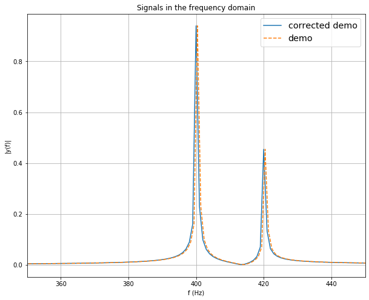

# bug-in-the-demo-file-of-scipy.fft
The official demo code of scipy.fft has a small bug

## Quick demo
The file fft_test1.py includes a demo code of implementing FFT using scipy.fft, from:
    https://docs.scipy.org/doc/scipy/reference/tutorial/fft.html#d-discrete-fourier-transforms
    
   
    But, This demo of scipy has a small bug: the f-axis missed the median point of the symmetrical spectrum,
    so that it will yield a very tiny frequency shift (e.g., < 0.001 Hz) as shown in the plot below.
    The correct demo is also shown in:
```
fft_test1.py
```

<p align="center">
    </a>
</p>
